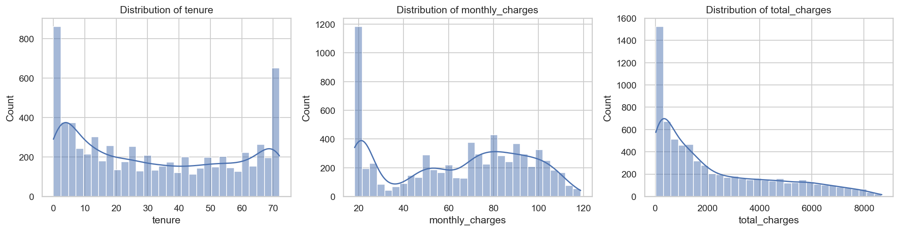
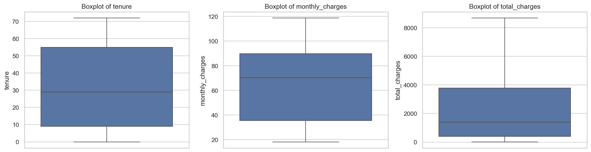
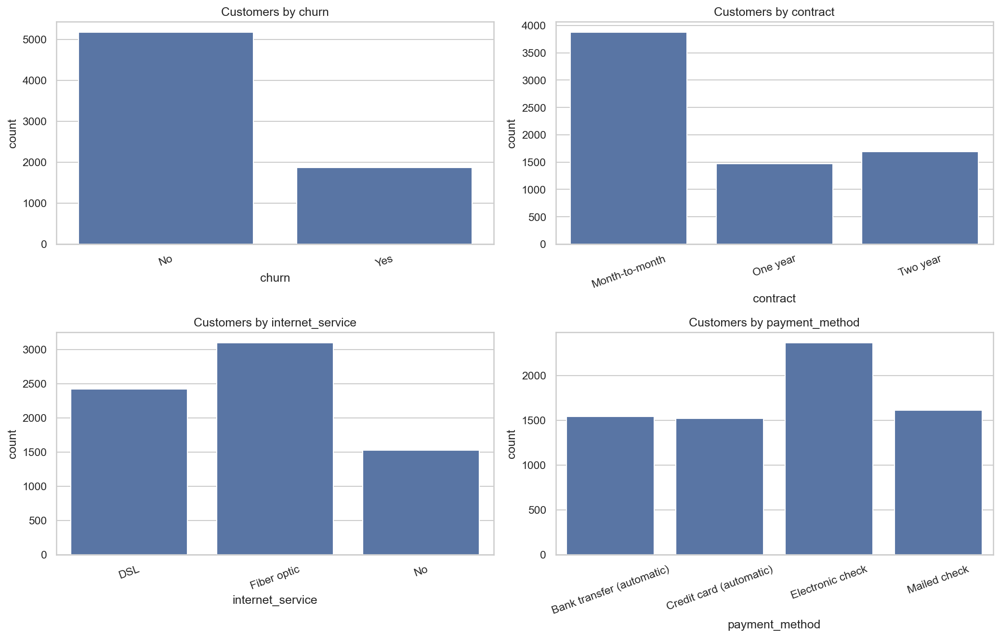
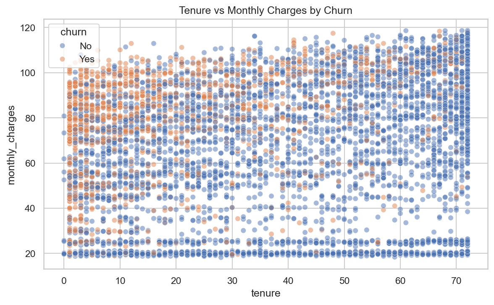
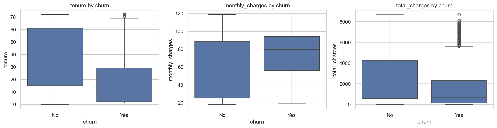
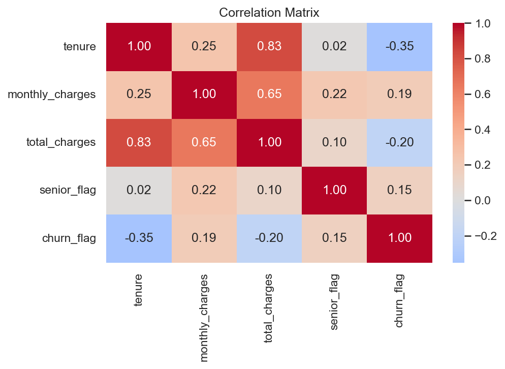
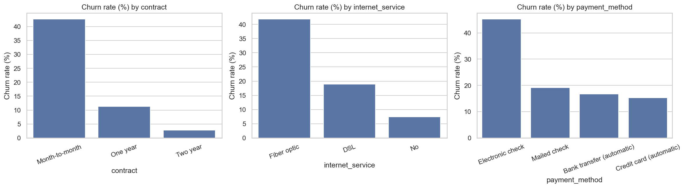

# Apexplanet Data Analytics: Tasks 1–2

**Data Cleaning, Exploratory Data Analysis (EDA), and MySQL Data Extraction**


## 📌 Project Overview

This project covers the first two tasks of the Apexplanet Data Analytics program: setting up a reproducible analytics environment, sourcing and cleaning a customer churn dataset, performing exploratory data analysis (EDA), and practicing SQL-based data extraction with MySQL and Python.

**Dataset analyzed:** IBM Telco Customer Churn (7,043 customers, 21 columns)
**Objective:** Identify the key factors associated with customer churn.
**Headline result:** 26.5% of customers churned, and contract type, tenure and internet service type were the strongest patterns.

Task 2 includes 20+ MySQL practice queries in [`sql/task2_queries.sql`](sql/task2_queries.sql), covering filtering, joins, aggregates, CTEs, subqueries, window functions, retention, reusable views, and `EXPLAIN`. The [`MySQL notebook`](notebooks/02_mysql_database.ipynb) integrates SQL with Python and Pandas for database connection, CSV loading, and automated query extraction using [`db_utils.py`](db_utils.py).

## 📁 Folder Structure

```
apexplanet-data-analytics/
├── data/
│   ├── raw/                # Original, unmodified dataset (Telco-Customer-Churn.csv)
│   └── processed/          # Cleaned data (telco_churn_clean.csv)
├── notebooks/
│   └── 02_mysql_database.ipynb  # Task 2: MySQL + Python practice
├── scripts/
│   └── 01_data_sourcing_and_cleaning.ipynb # Task 1: sourcing, cleaning and EDA
├── db_utils.py                  # MySQL connection, CSV loading and query helpers
├── sql/
│   └── task2_queries.sql        # MySQL practice queries, view and EXPLAIN
├── .env.example                 # MySQL settings template
├── requirements.txt
├── reports/
│   ├── cleaning_log.csv         # Log of every cleaning transformation
│   └── figures/                 # Saved EDA charts
├── dashboards/                  # Power BI / Tableau files (PBIX/TWBX)
└── README.md
```

## ⚙️ Environment Setup

**Prerequisites:** [Anaconda](https://www.anaconda.com/download) or Miniconda, Git

```bash
# 1. Clone the repository
git clone https://github.com/<your-username>/apexplanet-data-analytics.git
cd apexplanet-data-analytics

# 2. Create and activate the environment
conda create -n analytics python=3.10 -y
conda activate analytics

# 3. Install dependencies
pip install -r requirements.txt
pip install jupyter ipykernel

# 4. Launch Jupyter
jupyter notebook
```

**Libraries used:** pandas, numpy, matplotlib, seaborn, plotly, scikit-learn, sqlalchemy, PyMySQL

## ✅ Task 2: SQL & Data Extraction

The MySQL practice covers `SELECT`, `WHERE`, `ORDER BY`, `LIMIT`, `INNER`/`LEFT`/`RIGHT` joins, a MySQL-compatible `FULL OUTER JOIN` emulation, `GROUP BY`, `HAVING`, aggregate functions, subqueries, CTEs, and `ROW_NUMBER`, `RANK`, `LAG`, and `LEAD` window functions. Business-focused queries explore top customers by lifetime billed charges, retention and churn rates, and internet service category performance. The script also demonstrates a reusable view and query plan inspection with `EXPLAIN`; an optional index is documented for evaluation.

The notebook demonstrates connecting to MySQL, loading the cleaned CSV without overwriting an existing table, and extracting parameterized SQL results into Pandas DataFrames. See the [MySQL setup instructions](#task-2-mysql-setup) below.

### Task 2: MySQL setup

Create a MySQL database named `apexplanet`, copy `.env.example` to `.env`, and set your local connection credentials. Install project dependencies with `pip install -r requirements.txt`, then run `notebooks/02_mysql_database.ipynb`. The notebook loads `data/processed/telco_churn_clean.csv` into `telco_churn` (without replacing an existing table) and demonstrates SQL-to-Pandas extraction. Run the full query set in `sql/task2_queries.sql` with MySQL Workbench or the MySQL CLI.

The dataset has no transaction dates or order-line/product data. Monthly sales trends and product-category sales require a different dataset; the SQL practice instead analyzes customer retention, lifetime billed charges, recurring-charge snapshots, and internet service categories.

## 📊 Data Sources

| Item | Details |
|------|---------|
| **Dataset** | IBM Telco Customer Churn |
| **Source** | [Kaggle: Telco Customer Churn (IBM dataset)](https://www.kaggle.com/datasets/yeanzc/telco-customer-churn-ibm-dataset) |
| **File** | `data/raw/Telco-Customer-Churn.csv` |
| **Rows × Columns** | 7,043 × 21 |
| **Collection method** | Sample dataset published by IBM to demonstrate analytics tools; each row is one telecom customer |
| **Time period** | Single snapshot (no time dimension) |

**Known limitations:** The data is a fictional sample, so findings may not generalise to a real telecom company. It is a single snapshot with no dates, so trends over time can't be studied. It also has no location or customer-service history.

### Data Dictionary

| Column | Type (after cleaning) | Description |
|--------|------|-------------|
| `customer_id` | object | Unique customer identifier |
| `gender` | category | Male / Female |
| `senior_citizen` | category | Whether the customer is a senior citizen (Yes/No) |
| `partner` | category | Whether the customer has a partner |
| `dependents` | category | Whether the customer has dependents |
| `tenure` | int | Months the customer has stayed with the company |
| `phone_service` | category | Whether the customer has phone service |
| `multiple_lines` | category | Yes / No / No phone service |
| `internet_service` | category | DSL / Fiber optic / No |
| `online_security` | category | Online security add-on (Yes / No / No internet service) |
| `online_backup` | category | Online backup add-on |
| `device_protection` | category | Device protection add-on |
| `tech_support` | category | Tech support add-on |
| `streaming_tv` | category | Streaming TV add-on |
| `streaming_movies` | category | Streaming movies add-on |
| `contract` | category | Month-to-month / One year / Two year |
| `paperless_billing` | category | Whether the customer uses paperless billing |
| `payment_method` | category | Electronic check / Mailed check / Bank transfer (automatic) / Credit card (automatic) |
| `monthly_charges` | float | Amount charged per month |
| `total_charges` | float | Total amount charged over the customer's tenure |
| `churn` | category | **Target:** whether the customer left (Yes/No) |

## 🧹 Data Cleaning Summary

| Step | Action | Rows/Columns Affected |
|------|--------|-----------------------|
| Missing values | `total_charges` loaded as text because of blank strings; converted to numeric and filled the blanks with the median. All 11 affected customers have `tenure = 0` (brand-new customers) | 11 rows |
| Duplicates | Checked for exact duplicate rows; none found | 0 |
| Data types | `senior_citizen` mapped from 0/1 to No/Yes; text columns (except `customer_id`) converted to `category` | 17 columns |
| Outliers | IQR method (1.5×IQR) checked on `tenure`, `monthly_charges` and `total_charges`; no outliers found, so nothing was removed | 0 |
| Column names | Standardized to snake_case (e.g. `TotalCharges` → `total_charges`) | All 21 columns |

The full log is in [`reports/cleaning_log.csv`](reports/cleaning_log.csv), and the cleaned dataset (7,043 rows × 21 columns) is saved to `data/processed/telco_churn_clean.csv`.

## 🔍 Findings Summary

### Key Insights

1. **Contract type is the strongest driver of churn.** Month-to-month customers churn at **42.7%**, compared with **11.3%** on one-year contracts and **2.8%** on two-year contracts.
2. **New customers leave first.** The median tenure of churned customers is **10 months**, versus **38 months** for retained customers. Tenure has the strongest correlation with churn of the numeric features (r = **-0.35**).
3. **Higher bills and fiber optic service go with higher churn.** Churned customers pay **$74.4** per month on average versus **$61.3** for retained customers. Fiber optic customers churn at **41.9%**, against **19.0%** for DSL and **7.4%** for customers with no internet service.

### Patterns, Trends & Anomalies

- **Overall churn rate:** 26.5% (1,869 of 7,043 customers), so the target is moderately imbalanced.
- **Customer mix:** Month-to-month is the most common contract (3,875 customers), fiber optic is the most common internet service (3,096), and electronic check is the most common payment method (2,365).
- **Correlation with churn:** `tenure` -0.35, `total_charges` -0.20, `monthly_charges` 0.19, `senior_citizen` 0.15.
- **Strong overlap between features:** `tenure` and `total_charges` are strongly correlated (r = **0.83**), so using both together in a predictive model could add redundancy.
- **Data quality:** No duplicates and no IQR outliers. The only missing values were the 11 blank `total_charges` entries for customers with zero tenure.

### What this suggests

Retention effort is likely best aimed at **new, month-to-month customers**, especially those on **fiber optic** plans. Encouraging longer contracts looks like a promising lever. These are patterns in the data, not proven causes, and testing them would need further analysis.

### Visualizations

| | |
|---|---|
|  |  |
|  |  |
|  |  |



## 🚀 How to Reproduce

1. Complete the environment setup above.
2. Download the dataset from [Kaggle](https://www.kaggle.com/datasets/yeanzc/telco-customer-churn-ibm-dataset) and place `Telco-Customer-Churn.csv` in `data/raw/`.
3. Open `scripts/01_data_sourcing_and_cleaning.ipynb` with the **Python (analytics)** kernel and run all cells.
4. Outputs are written to `data/processed/`, `reports/cleaning_log.csv` and `reports/figures/`.

## 🗄️ Load the cleaned CSV into local MySQL

The MySQL workflow is in [`notebooks/02_mysql_database.ipynb`](notebooks/02_mysql_database.ipynb), with reusable connection, CSV-loading and query helpers in [`db_utils.py`](db_utils.py).

1. Install the project requirements, including the MySQL DBAPI driver:

   ```bash
   pip install -r requirements.txt
   ```

2. Create the target database in MySQL if it does not already exist:

   ```sql
   CREATE DATABASE apexplanet;
   ```

3. Copy `.env.example` to `.env` in the project root and set your local MySQL values there. `db_utils.py` loads this file when creating the engine. `.env` is ignored by Git, so keep the real password there and out of notebooks/source control:

   ```dotenv
   DB_HOST=localhost
   DB_PORT=3306
   DB_USER=your_mysql_user
   DB_PASSWORD=your_mysql_password
   DB_NAME=apexplanet
   ```

   Process environment variables with the same names take precedence over values from `.env`. Then launch Jupyter.

4. Open `notebooks/02_mysql_database.ipynb` and run its cells. It loads `data/processed/telco_churn_clean.csv` into `telco_churn`, checks the connection, then demonstrates a parameterized SQL query returned as a pandas DataFrame. The loader defaults to `if_exists="fail"` so it will not overwrite a table on rerun; choose `append` or `replace` explicitly only when appropriate.

## 🛠️ Next Steps

- Explore additional relationships (add-on services, payment method and demographics vs churn).
- Build a churn prediction model, handling the class imbalance and the `tenure` / `total_charges` overlap.
- Create an interactive dashboard in `dashboards/` (Power BI or Tableau).

## 👤 Author

**Rahul Kuiry**
📧 rahulkuiry04@gmail.com
🔗 [LinkedIn](https://www.linkedin.com/in/rahul-kuiry-419049261/) | 🔗  [GitHub](https://github.com/rahulkuiry-04/)

---
*Completed as part of the Apexplanet Data Analytics Internship, Tasks 1 and 2.*